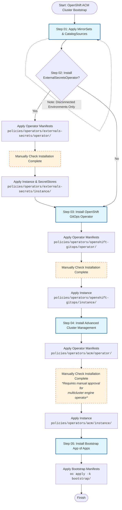

# OpenShift ACM Cluster Bootstrap

aushacker<br/>
March 2026<br/>

## Overview

## Step 01 - Apply MirrorSets and CatalogSources (Disconnected Only)

For now this is a place holder. In a disconnected environment you need to apply the following:

- ImageDigestMirrorSet
- ImageTagMirrorSet
- CatalogSource

These are generated by the oc-mirror utility.

## Step 02 - (Optional) Install ExternalSecretsOperator

Secrets are required by several operators. During day 2 bootstrap the choice is to apply
each of them manually or automate their application. Automation requires one or more
external secret stores e.g. hashicorp Vault.

If automation is chosen then provide customised `SecretStore` CRs under `instance`
and add `ExternalSecret` CRs as required by the dependent operators.

```
oc apply -k policies/operators/externals-secrets/operator/

# Manually check for operator installation complete

oc apply -k policies/operators/externals-secrets/instance/
```

## Step 03 - Install OpenShift Gitops Operator

```
oc apply -k policies/operators/openshift-gitops/operator/

# Manually check for operator installation complete

oc apply -k policies/operators/openshift-gitops/instance/
```

## Step 04 - Install Advanced Cluster Management

```
oc apply -k policies/operators/acm/operator/

# Manually check for operator installation complete

oc apply -k policies/operators/acm/instance/
```

NB. ACM requires the multicluster engine operator, this also needs
to be manually approved.

## Step 05 - Install Bootstrap App of Apps

```
oc apply -k bootstrap/
```


